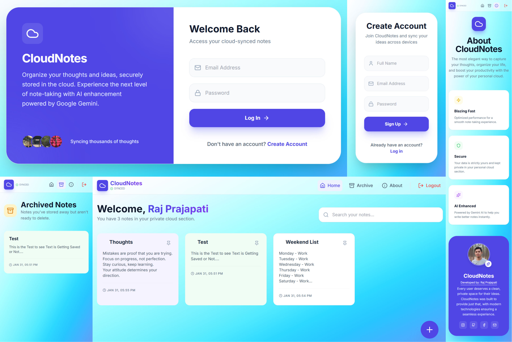

# CloudNotes

**CloudNotes** is a modern note-taking web application built with **React.js + Vite** and **Supabase** for backend services. It allows users to create, edit, archive, pin, and organize notes with a drag-and-drop interface. The app also features AI-powered text enhancement for better note-taking.

🔗 **Live Website**: [https://cloudnotes-rajprajapati2001s-projects.vercel.app/](https://cloudnotes-rajprajapati2001s-projects.vercel.app/)

---

## 📌 Features

- **User Authentication**: Secure login and signup with dashboard access.
- **Note Management**:
  - Create, edit, and delete notes.
  - Pin important notes.
  - Archive notes for later reference.
  - Drag-and-drop to reorder notes.
  - Change note background color.
- **AI Enchanter**: Enhance your notes with AI-powered text suggestions.
- **Responsive Design**: Works seamlessly on all devices.

---

## 📸 Screenshots



---
### 🌐 Pages

*   **Home**: Dashboard with all notes.
*   **Archive**: View and restore archived notes.
*   **About**: Information about the app.
*   **Logout**: Securely log out of the app.

## 🔧 Built With

*   **Frontend**: [React.js](https://react.dev) + [Vite](https://vitejs.dev)
*   **Backend**: [Supabase](https://supabase.com) (Authentication + Database)
*   **Styling**: [TailwindCSS](https://tailwindcss.com)
*   **AI**: Google AI text enhancement

---
## 📂 File Structure
```bash
CloudNotes
├── assets
│   ├── cloud-icon.png
│   ├── cloudnotes_icon_128.png
│   └── me_picture_logo_1000x1000.jpg
├── components
│   ├── Navbar.tsx
│   ├── NoteCard.tsx
│   └── NoteModal.tsx
├── lib
│   └── supabase.ts
├── database
│   └── schema.sql
├── pages
│   ├── About.tsx
│   ├── Archive.tsx
│   ├── Dashboard.tsx
│   └── Login.tsx
├── services
│   └── geminiService.ts
├── .env.local
├── App.tsx
├── constants.ts
├── index.html
├── index.tsx
├── package-lock.json
├── package.json
├── types.ts
└── vite.config.ts
```
---

## ⚙️ Installation & Setup

Get your local environment running in seconds by following these steps:

### 1. Clone the Repository
```bash
git clone https://github.com/rajprajapati2001/CloudNotes.git
cd cloudnotes
```
### 2. Configure Environment Variables
Create a `.env` file in the root directory and add your **Supabase** credentials:
```bash
# .env file
REACT_APP_SUPABASE_URL=https://your-project-id.supabase.co
REACT_APP_SUPABASE_KEY=your-public-anon-key
GEMINI_API_KEY=google-aistudio-api-key
```
### 3. Initialize Database
Run the provided SQL schema [SQL File](database/schema.sql) in your Supabase SQL Editor to set up the `notes` table and **Row-Level Security (RLS)** policies.

### 4. Start Development Server
```bash
npm run dev
```

---

## 📜 License

This project is open-source and available under the [MIT License](LICENSE).

---
**Raj Prajapati**

Developed on `30th January 2026`/`Friday`.

